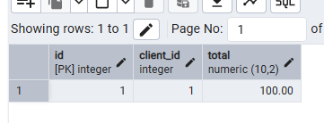
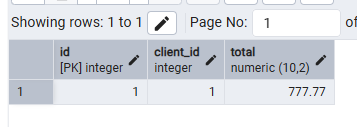
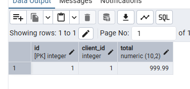
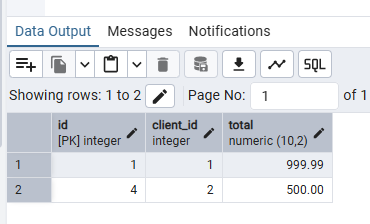
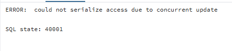
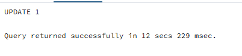

# Questões sobre Transações

## 1. O que é uma transação?

Transação é uma lógica de trabalho que agrupa uma ou mais operações no banco de dados, que devem ser executadas de forma completa ou não executadas, garantindo integridade dos dados.

## 2. Qual é o significado da sigla ACID?

- **A: Atomicidade** – a transação é indivisível, se falhar, tudo volta ao estado anterior.
- **C: Consistência** – a transação leva o banco de dados de um estado válido para outro estado válido.
- **I: Isolamento** – cada transação deve ocorrer isoladamente, sem interferência de outras.
- **D: Durabilidade** – após o commit, as alterações são permanentes, mesmo em casos de falha.

## 3. Comandos de controle de transações

- **BEGIN**: Inicia a transação.
- **SAVEPOINT**: Define um ponto intermediário para voltar se necessário.
- **COMMIT**: Finaliza e confirma todas as alterações feitas.
- **ROLLBACK**: Desfaz todas as operações desde o início da transação ou desde o savepoint.

## 4. Problemas de isolamento com transações concorrentes

- **Dirty read**: Ler dados não confirmados por outra transação.
- **Non-repeatable read**: Dados mudam entre duas leituras da mesma transação.
- **Phantom read**: Novas linhas aparecem ou desaparecem nas leituras dentro da mesma transação.

## 5. Níveis de isolamento

- **Read Uncommitted**: Permite dirty read.
- **Read Committed**: Permite non-repeatable reads, mas não dirty reads.
- **Repeatable Read**: Evita non-repeatable reads, mas pode ter phantom reads.
- **Serializable**: Isolamento total, evitando todos os problemas, mas com mais bloqueios e impacto de performance.

## 6. Como configurar o nível de isolamento de uma transação?

```sql
BEGIN;
SET TRANSACTION ISOLATION LEVEL REPEATABLE READ;
-- operações da transação
COMMIT;
```

## 7. Experimento com READ COMMITTED e REPEATABLE READ

### READ COMMITTED

**SESSÃO 1:**

```sql
BEGIN;
SET TRANSACTION ISOLATION LEVEL READ COMMITTED;
SELECT * FROM orders WHERE id = 1;
-- consulta1
```

**SESSÃO 2:**

```sql
BEGIN;
SET TRANSACTION ISOLATION LEVEL READ COMMITTED;
UPDATE orders SET total = 999.99 WHERE id = 1;
COMMIT;
```

- **iv** Na sessão 1, faça uma consulta

-

- **vi.** Repita a consulta na sessão 1

-

- **vi.**O valor não mudou, porque a transação da SESSÃO 2 ainda não foi comitada.

- **Viii.** repita a consulta 

-

- **viii.** O valor mudou, porque o read committed permite ver alterações comitadas.

- **ix.** repita a consulta

- 

- **x.** O valor continua o mesmo, pois após commit a transação foi encerrada e a próxima leitura usa novo snapshot.

### REPEATABLE READ

**SESSÃO 1:**

```sql
BEGIN;
SET TRANSACTION ISOLATION LEVEL REPEATABLE READ;
SELECT * FROM orders WHERE id = 1;
```

**SESSÃO 2:**

```sql
BEGIN;
SET TRANSACTION ISOLATION LEVEL REPEATABLE READ;
UPDATE orders SET total = 999.99 WHERE id = 1;
```

- **iv** Consulta inicial

-

- **vi** Consulta após update!

-[](./vii-consulta-apos-update.PNG)

- **vi.** O valor continua o mesmo, pois está preso ao snapshot da transação.

- **viii.** Consulta após o commit da sessão 2 

-

- **viii,** Valor continua o mesmo, pois ainda não foi feito o commit na sessão 1.

- **x.** Consulta após o commit da sessão 1

-[](./ix-consultandonovamente.PNG)

- **x.** Agora vê 999.99 porque é uma nova transação.

## 8. Anomalia Phantom Read

### a) Com READ COMMITTED

**SESSÃO 1:**

```sql
BEGIN;
SET TRANSACTION ISOLATION LEVEL READ COMMITTED;
SELECT * FROM orders WHERE total > 300;
```


- **resultado** 


**SESSÃO 2:**

```sql
BEGIN;
SET TRANSACTION ISOLATION LEVEL READ COMMITTED;
INSERT INTO orders (id, client_id, total) VALUES (4, 2, 500.00);
COMMIT;
```

**SESSÃO 1 (de novo):**

```sql
SELECT * FROM orders WHERE total > 300;
```


- **resultado** 


→ Resultado diferente apareceu uma linha a mais: ocorreu phantom read.

### b) Com SERIALIZABLE

**SESSÃO 1:**

```sql
BEGIN;
SET TRANSACTION ISOLATION LEVEL SERIALIZABLE;
SELECT * FROM orders WHERE total > 300;
```


- **resultado** 


**SESSÃO 2:**

```sql
BEGIN;
SET TRANSACTION ISOLATION LEVEL SERIALIZABLE;
INSERT INTO orders (id, customer_id, total) VALUES (5, 2, 600.00);
COMMIT;
```

**SESSÃO 1 (de novo):**

```sql
SELECT * FROM orders WHERE total > 300;
```


- **resultado** 


→ SERIALIZABLE evitou a anomalia do phantom read, não apareceu a nova linha inserida na sessão 2.

## Questão 9 

---

## a) Teste com nível de isolamento `READ COMMITTED`

```sql
BEGIN;
SET TRANSACTION ISOLATION LEVEL READ COMMITTED;
```

3. Ambas tentam executar um `UPDATE` na mesma linha:

**SESSÃO 1:**

```sql
UPDATE orders SET total = 888.88 WHERE id = 1;
```

**SESSÃO 2:**

```sql
UPDATE orders SET total = 999.99 WHERE id = 1;
-- Fica bloqueada até a transação 1 terminar
```

4. Após o `COMMIT` da SESSÃO 1:

```sql
COMMIT;
```

A transação da SESSÃO 2 é desbloqueada e o `UPDATE` é aplicado.

### Resultado:

A transação 2 **espera** a liberação do lock e aplica seu `UPDATE`.


**Resultado:** 


---

## b) Teste com nível de isolamento `SERIALIZABLE`


1. 

```sql
BEGIN;
SET TRANSACTION ISOLATION LEVEL SERIALIZABLE;
```

2. Ambas executam `UPDATE` na mesma linha:

**SESSÃO 1:**

```sql
UPDATE orders SET total = 888.88 WHERE id = 1;
```

**SESSÃO 2:**

```sql
UPDATE orders SET total = 999.99 WHERE id = 1;
-- Aguarda o desfecho da transação 1
```

3. Ao executar `COMMIT` na SESSÃO 1:

```sql
COMMIT;
```

4. A SESSÃO 2 falha com o erro:


- 


### Resultado:

A transação 2 **é abortada** automaticamente por conflito de serialização.

---

## c) Mesmo teste, mas com `ROLLBACK` na SESSÃO 1

**SESSÃO 1:**

```sql
UPDATE orders SET total = 888.88 WHERE id = 1;
```

**SESSÃO 2:**

```sql
UPDATE orders SET total = 999.99 WHERE id = 1;
-- Aguardando...
```

3. A SESSÃO 1 faz `ROLLBACK`:

```sql
ROLLBACK;
```

4. A SESSÃO 2 é liberada e seu `UPDATE` é executado com sucesso.


- 


### Resultado:

A transação 2 **é executada com sucesso**, pois o conflito foi desfeito.

**Valor final do `total`:**


-


---
